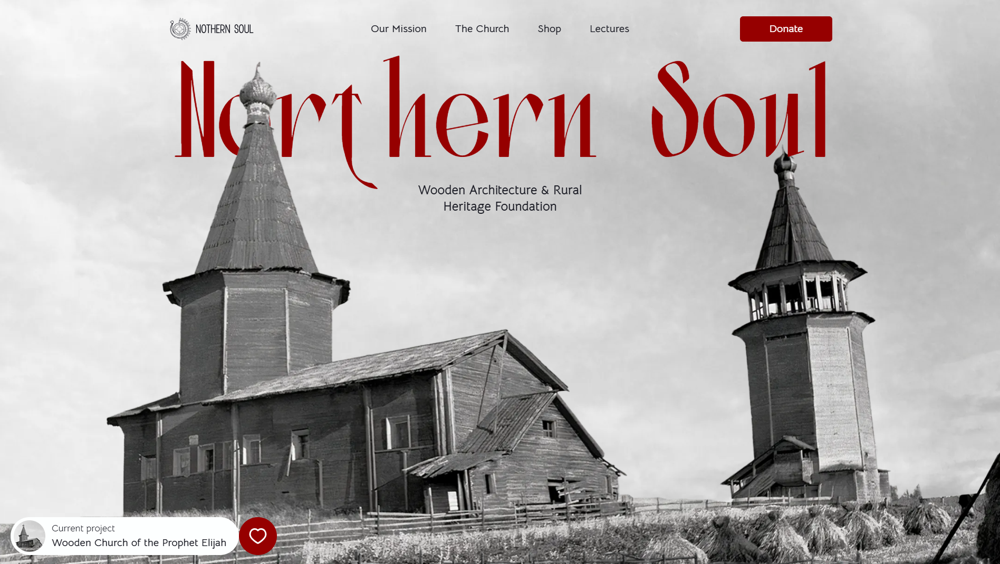

# Northern Soul

> A non-profit foundation preserving the wooden architecture and cultural heritage of the Baltic-Slavic north.

**[Live demo →](https://northern-soul.vercel.app)**



## Highlights

- **98 / 100 / 100 / 100** Lighthouse scores (desktop) - Performance, Accessibility, Best Practices, SEO
- **Multi-layer parallax hero** with a custom `useParallax` hook - four separate PNG layers moving at different speeds create depth on scroll
- **Scroll-driven animations** powered by Lenis and custom `useScrollProgress` / `useRevealOnScroll` hooks - the mission section temple rises from below and pillar cards stagger in based on scroll position
- **Editorial responsive design** - desktop-first with `hidden-mobile` / `visible-mobile` utilities, breakpoint-aware conditional image loading via `useMediaQuery` (mobile devices don't download desktop parallax layers)

## Tech stack

- **React 19** + **Vite 7**
- **SCSS** with strict BEM (`&` nesting, flat `blocks/` folder, `@use` imports)
- **Lenis** for smooth scroll
- Custom hooks: `useParallax`, `useScrollProgress`, `useRevealOnScroll`, `useMediaQuery`, `useCarousel`, `useSwipeCarousel`, `useCountUp`
- **WebP** images (converted from source assets via `scripts/convert-to-webp.mjs`, using Sharp), lazy loading for below-fold content
- Deployed on **Vercel**

## Getting started

```bash
npm install
npm run dev
```

Open http://localhost:5173

## Build

```bash
npm run build
npm run preview
```

## Project structure

```
src/
├── assets/
│   ├── icons/
│   └── images/
├── hooks/
│   ├── useCarousel.js
│   ├── useCountUp.js
│   ├── useMediaQuery.js
│   ├── useParallax.js
│   ├── useRevealOnScroll.js
│   ├── useScrollProgress.js
│   └── useSwipeCarousel.js
├── styles/
│   ├── blocks/       # BEM blocks per section
│   ├── _fonts.scss
│   ├── _media.scss   # breakpoints + mixins
│   ├── _mixins.scss
│   ├── _normalize.scss
│   ├── _variables.scss  # design tokens
│   └── main.scss
├── App.jsx
└── main.jsx
```

## Credits

Illustrations and photography sourced from open archives for portfolio
demonstration purposes. This is a fictional non-profit; not affiliated
with any real organization.
